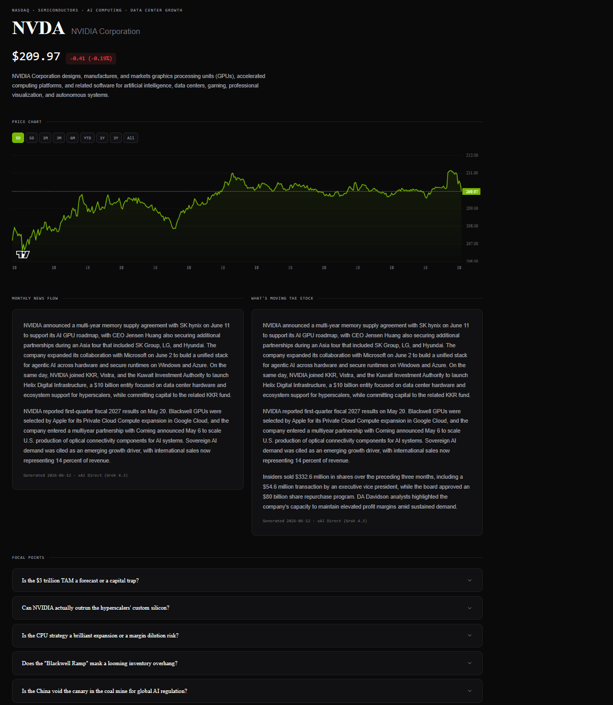
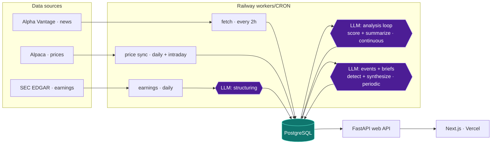

# NeuralWire

Thousands of financial articles are published every day, and separating signal from noise — even across a handful of stocks — is a full-time job. What if every stock had a single page: the news that actually moved it, the points analysts are debating, and the open questions worth watching?

NeuralWire is that page. For each ticker on a curated watchlist, it distills the latest news into a focused brief — what happened, what's moving the stock, and the burning open questions — alongside live daily and intraday price charts.

**Live:** [neuralwire.net](https://neuralwire.net) (early-stage alpha)



---

## Design highlights

- **Cost efficient, tiered router.** Calls route across an `economy → standard → premium` ladder of models (OpenRouter + xAI Grok). The router auto-escalates on failure, retries with exponential backoff, and disables any provider that hits a rate or quota limit mid-run — so one bad provider never breaks a pipeline pass. ([`llms.py`](python_backend/llms.py))
- **~$6/month for 3,000+ LLM calls a day.** The bulk of calls — noise filtering, scoring, event scans — run on very cheap economy models; standard-tier models handle synthesis; Grok 4.3 with live web + X search is the one premium call, reserved for the daily "what's moving" brief.
- **Precise context retrieval.** Prompts are injected with compact, pre-curated context — AI summaries of high-relevance articles, structured event timelines, and rolling period summaries — instead of raw article text, for signal at a fraction of the tokens. ([`_build_monthly_context`](python_backend/analysis.py))
- **Clean, auditable storage.** Lightweight article metadata is separated from heavy scraped text, and llm output is saved with the model and prompt.

---


## Architecture

Three surfaces: a Next.js frontend on Vercel, a FastAPI web API on Railway, and a set of Railway worker/cron services that keep a PostgreSQL database fresh. Workers write to the database; the API reads from it to serve the frontend.



### The pipeline, stage by stage

| Stage | Cadence | What happens |
|---|---|---|
| **Fetch** | every 2h | Pull news per ticker (rotating index), dedupe on URL, insert into the registry |
| **Store** | — | Lightweight metadata split from heavy scraped text; per-article and rolling monthly summaries kept up to date |
| **Analyze** | continuous | Scrape full text (parallel), regex + cheap LLM noise filter, then score and summarize each article |
| **Detect** | periodic | Two-pass event detection — a cheap scan proposes candidates, a higher tier validate pass double checks before appending to the event log |
| **Brief** | daily / on earnings | Regenerate per-ticker briefs, focal points and other user facing artefacts |
| **Prices** | after close + intraday | Sync daily and intraday OHLCV bars from Alpaca |

---

## PostgreSQL Data model

([`database.py`](python_backend/database.py)):

| Table | Role |
|---|---|
| `articles` | Deduped news registry — metadata plus scrape and analysis status |
| `article_content` | Raw + curated text |
| `analysis_runs` | Per-article AI scores, summary, and model/prompt IDs |
| `summaries` | Historical and rolling period summaries |
| `ticker_artefacts` | Generated UI briefs (focal points, monthly news flow, header) |
| `ticker_events` | Structured event timeline of key company moments |
| `earnings` / `earnings_documents` / `earnings_reactions` | Earnings anchors, quality-scored source docs, and analyzed reactions |
| `historical_prices` / `intraday_prices` | Indexed OHLCV bars |

---

## Tech stack

| Layer | Tools |
|---|---|
| **Frontend** | Next.js (App Router, TypeScript), Tailwind CSS — deployed on Vercel |
| **Backend** | FastAPI (Python), deployed on Railway |
| **Database** | PostgreSQL (Railway) |
| **AI** | xAI Grok 4.3 (X search), OpenRouter (multi-model routing) |
| **Data sources** | Alpha Vantage (news), Alpaca Markets (prices), SEC EDGAR + earnings transcripts |
| **Scraping** | trafilatura (parallel full-text extraction) |

---

## Local development

Requires Docker and Node. A Postgres 16 container matching production runs on port 5433, seeded from a database dump on first start.

```bash
pip install -r requirements.txt
cd frontend && npm install

make            # list available commands
make db         # start the local database
make api        # FastAPI backend on :8000
make frontend   # Next.js dev server on :3000
make db-reset   # wipe and re-seed the database
```

With `DATABASE_URL` unset the backend connects to the local container; set it to target a deployed database instead.

Backend jobs are driven by small `run_*.py` entrypoints (`run_fetch.py`, `run_analysis.py`, `run_events.py`, `run_earnings.py`, `run_sync_daily_prices.py`, …), wired to Railway cron/worker services. Configuration is via environment variables (`DATABASE_URL`, `OPENROUTER_KEY`, `XAI_API_KEY`, `ALPHA_VANTAGE_API_KEY`, `ALPACA_KEY`, `ALPACA_SECRET`). In local dev, API calls are proxied through `/api` ([`next.config.ts`](frontend/next.config.ts)) so the browser stays same-origin.

---

## Status & disclaimer

NeuralWire is an early-stage project under active development. Data may be incomplete, delayed, or inaccurate, and AI-generated summaries can contain errors. Nothing here is financial advice — do your own research.

Contact: [latentdreamlabs@gmail.com](mailto:latentdreamlabs@gmail.com)

