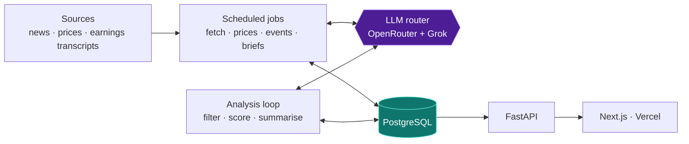
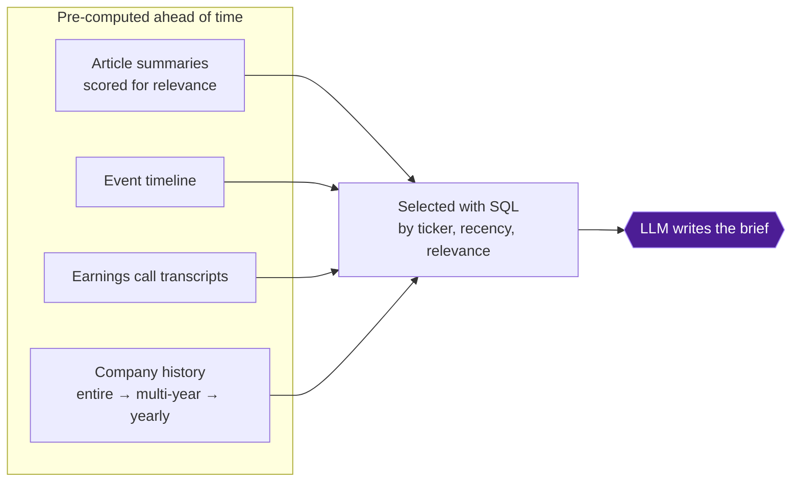

# NeuralWire

[](https://github.com/sthoresen/neuralwire/actions/workflows/ci.yml)

Thousands of financial articles are published every day, and separating signal from noise is a full-time job, even for a handful of stocks. What if every stock had a single page: the news that actually moved it, the points analysts are debating, and the open questions worth watching?

NeuralWire is that page. For each ticker on a curated watchlist, it distills the latest news into a focused brief covering what happened, what's moving the stock and the burning open questions, shown next to live daily and intraday price charts.

**Live:** [neuralwire.net](https://neuralwire.net) (early-stage alpha)


---

## Design highlights

- **~$6/month for 3,000+ LLM calls a day.** The majority of calls like noise filtering, scoring and event scans run on very cheap economy models. Standard-tier models handle synthesis, Grok with live X search is the one premium call, reserved for the weekly "what's moving" brief.
- **Precise context retrieval.** Every article is scored and summarised by a background analysis loop, events are distilled into a timeline, and company history is pre-summarised at several resolutions. Briefs are then written from a compact, SQL-selected slice of that structure: A structured take on RAG, [more below](#context-engineering).
- **Auditable by design.** Every LLM output is stored with the model and prompt version that produced it, and article metadata is kept apart from heavy scraped text.
- **Cost efficient, tiered router.** Calls route across an `economy → standard → premium` ladder of models (OpenRouter + xAI Grok), escalating to the next tier when a tier fails. Errors are classified by HTTP status: rate limits and outages are retried with backoff, while providers that are out of credits or deprecated are switched off immediately instead of being retried. ([`llms.py`](python_backend/llms.py))
- **Production discipline.** 100+ tests, CI on every push, and one Docker image that runs identically on a laptop, in CI and in production — [details below](#engineering-practices).

---


## Architecture

Three surfaces: a Next.js frontend on Vercel, a FastAPI web API on Railway, and a set of Railway workers that keep a PostgreSQL database fresh. Workers write to the database; the API reads from it to serve the frontend.




### The pipeline, stage by stage

| Stage | Cadence | What happens |
|---|---|---|
| **Fetch** | every 2h | Pull news per ticker (rotating index), dedupe on URL, insert into the registry |
| **Analyze** | continuous | Drop noise with a regex and a cheap LLM filter on the headline, scrape the full text in parallel, then score and summarise the article for each ticker it affects |
| **Detect** | every 4h | Two-pass major event detection: A cheap scan proposes candidates, a higher tier validate pass double checks before appending to the event log |
| **Brief** | weekly / on earnings | Regenerate each ticker's news-flow brief and focal points |
| **Earnings** | daily | Pull new earnings call transcripts from defeatbeta; a new transcript triggers a brief refresh |
| **Prices** | after close + on demand | Sync daily and intraday OHLCV bars from Alpaca |

The periodic jobs are scheduled by [scheduler.py](scheduler.py) (APScheduler). The analysis loop runs as its own service, so a crash there never stops the scheduled jobs.

---

## Context engineering

Most RAG (retrieval-augmented generation) systems split documents into chunks, embed them, and fetch the chunks most similar to the question. That works well for looking up a fact, but a brief like "what's moving NVDA this month" needs the big picture across dozens of articles, which similarity search tends to lose. NeuralWire retrieves by structure instead: it does most of the reading up front, stores the results as scored summaries, events and company history, and selects from them with SQL.



For the news-flow brief, [`_build_monthly_context`](python_backend/analysis.py) assembles four compact blocks: the last 60 days of events, the ten most relevant article summaries from the past 30 days, the latest earnings reaction, and the most recent yearly summary as backdrop.

---


## Data model

PostgreSQL, defined in [database.py](python_backend/database.py) and [market_data.py](python_backend/market_data.py):

| Table | Role |
|---|---|
| `articles` | Deduped news registry — metadata plus scrape and analysis status |
| `article_content` | Raw + curated scraped text |
| `analysis_runs` | Per-article, per-ticker AI scores and summary, with model and prompt IDs |
| `summaries` | Company history summarised at several resolutions (entire history, multi-year, yearly) |
| `ticker_artefacts` | Generated UI briefs (focal points, monthly news flow, header) |
| `ticker_events` | Structured event timeline of key company moments |
| `earnings` / `earnings_documents` / `earnings_reactions` | Earnings anchors, quality-scored source docs, and analyzed reactions |
| `historical_prices` / `intraday_prices` | Indexed OHLCV bars |

---

## Engineering practices

- **Tests.** 100+ unit and API tests. The LLM router is tested against real OpenRouter error responses taken from production logs.
- **CI.** Every push runs Ruff (lint and format), the test suite, and a second job that builds the full Docker stack and smoke-tests it end to end ([`ci.yml`](.github/workflows/ci.yml)).
- **Safe deploys.** Railway only deploys commits that pass CI, and the web service must answer `/health` before it takes traffic, so a version that fails to start never replaces the running one.
- **One environment everywhere.** The same [`Dockerfile`](Dockerfile) runs locally, in CI and in production, with the Python version pinned in [`.python-version`](.python-version).

---

## Tech stack

| Layer | Tools |
|---|---|
| **Frontend** | Next.js (App Router, TypeScript), Tailwind CSS — deployed on Vercel |
| **Backend** | FastAPI (Python 3.13), APScheduler — deployed on Railway as a Docker image |
| **Database** | PostgreSQL 18 (Railway) |
| **AI** | xAI Grok (X search), OpenRouter (multi-model routing) |
| **Data sources** | Alpha Vantage (news), Alpaca Markets (prices), defeatbeta (earnings transcripts) |
| **Scraping** | trafilatura (parallel full-text extraction) |
| **Tooling** | Docker Compose, GitHub Actions, pytest, Ruff |

---

## Local development

Requires only Docker. One command starts Postgres (seeded with demo data), the API and the frontend:

```bash
make up         # or: docker compose up --build
```

Then open http://localhost:3000, or http://localhost:8000/docs for the interactive API docs.

```bash
make            # list all commands
make reset      # delete the local database and start again from the demo seed
make db-shell   # psql on the local database
make test       # run the test suite (needs `pip install -r requirements-dev.txt`)
```

Workers aren't started by default, since they call paid APIs. With keys in `python_backend/.env`, run one against the local database with `docker compose run --rm api python run_analysis.py`. The demo seed is a small read-only sample of production, refreshed with `make seed` (see [`db/pull_demo_seed.sh`](db/pull_demo_seed.sh)).

Each backend job is a small run_.py entrypoint (run_fetch.py, run_analysis.py, run_events.py, …) that can also be run on its own.

Configuration is via environment variables (`DATABASE_URL`, `OPENROUTER_KEY`, `XAI_API_KEY`, `ALPHA_VANTAGE_API_KEY`, `ALPACA_KEY`, `ALPACA_SECRET`). In local dev, API calls are proxied through `/api` ([`next.config.ts`](frontend/next.config.ts)) so the browser stays same-origin.

---

## Status & disclaimer

NeuralWire is an early-stage project under active development. Data may be incomplete, delayed, or inaccurate, and AI-generated summaries can contain errors. Nothing here is financial advice. Do your own research.

Contact: [latentdreamlabs@gmail.com](mailto:latentdreamlabs@gmail.com)

